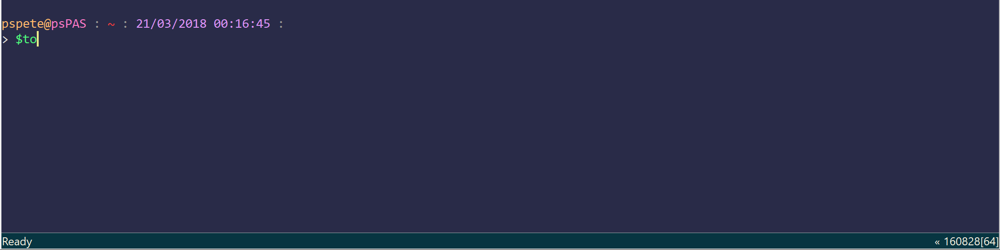
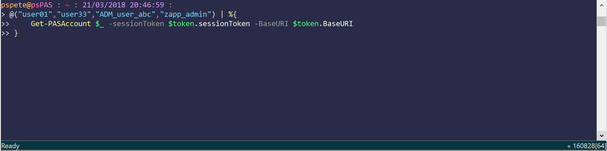
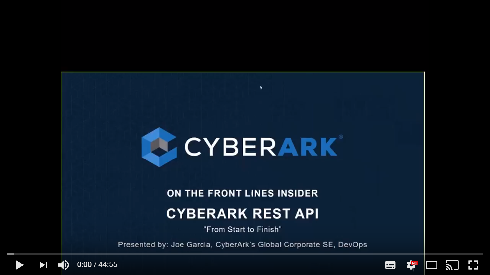

# psPAS

## **PowerShell Module for CyberArk Privileged Access Security**

Use PowerShell to manage CyberArk via the Web Services REST API.

Contains all published methods of the API up to CyberArk v10.9.

----------

## Module Status

| Master Branch            | Code Coverage            | PowerShell Gallery       | License                   |
|--------------------------|--------------------------|--------------------------|---------------------------|
|[![appveyor][]][av-site]  | [![coveralls][]][cv-site]|[![psgallery][]][ps-site]|[![license][]][license-link]|


| Latest Build (All Branches) |
|-----------------------------|
|[![tests][]][tests-site]     |

[appveyor]:https://ci.appveyor.com/api/projects/status/j45hbplm4dq4vfye/branch/master?svg=true
[av-site]:https://ci.appveyor.com/project/pspete/pspas/branch/master
[coveralls]:https://coveralls.io/repos/github/pspete/psPAS/badge.svg
[cv-site]:https://coveralls.io/github/pspete/psPAS
[psgallery]:https://img.shields.io/powershellgallery/v/psPAS.svg
[ps-site]:https://www.powershellgallery.com/packages/psPAS
[license]:https://img.shields.io/github/license/pspete/psPAS.svg
[license-link]:https://github.com/pspete/psPAS/blob/master/LICENSE.md
[tests]:https://img.shields.io/appveyor/tests/pspete/pspas.svg
[tests-site]:https://ci.appveyor.com/project/pspete/pspas

----------

- [psPAS](#pspas)
  - [Introduction](#powershell-module-for-cyberark-privileged-access-security)
    - [Status](#module-status)
  - [Usage](#usage)
  - [Module Functions](#module-functions)
  - [Installation](#installation)
    - [Prerequisites](#prerequisites)
    - [Install Options](#install-options)
    - [Verification](#verification)
  - [Changelog](#changelog)
  - [Author](#author)
  - [License](#license)
  - [Contributing](#contributing)
  - [Acknowledgements](#acknowledgements)

## Usage

It all starts with a **Logon**


The output of _`New-PASSession`_ can be used as input for subsequent commands.


In the below examples, the **`$token`** variable contains the values for the</br>
_`sessionToken`_ & _`baseURI`_ parameters, which are mandatory for all functions.


Use the pipeline to allow multiple successive commands to be executed.


**Save time on repetitive support tasks...**

Unlock Users:


Add Users as Group Members:


Streamline your safe creation process...


Achieve consistent safe permissions...


Enact changes across multiple safes, with speed...




Onboard a User Account...


Onboard User Accounts, in bulk...


Check-In locked accounts...


Make changes to multiple managed accounts...




See the module in action in the below "_CyberArk REST API: From Start-to-Finish_" video:

[](https://www.youtube.com/watch?v=yZinhjsuV1I)

## <a id="CyberArk_Version_Compatibility"></a> Module Functions

Your version of CyberArk determines which functions of psPAS will be supported.

Check the below table to determine what is available for you to use.

The CyberArk Version listed is the minimum required to use the function.

The module will attempt to confirm that your version of CyberArk meets the minimum

version requirement (if you are using version 9.7+, and the function being invoked

requires version 9.8+).

**Function Name**                                                                        |**CyberArk Version**|**Description**
-----------------------------------------------------------------------------------------|--------------------|:----------------
[`New-PASSession`][New-PASSession]                                                       |**9.0**             |Authenticates a user to </br>CyberArk Vault
[`Close-PASSession`][Close-PASSession]                                                   |**9.0**             |Logoff from CyberArk Vault.
[`New-PASSAMLSession`][New-PASSAMLSession]                                               |**9.7**             |Authenticates a user to </br>CyberArk Vault using SAML
[`Close-PASSAMLSession`][Close-PASSAMLSession]                                           |**9.7**             |Logoff from CyberArk </br>Vault SAML Session.
[`New-PASSharedSession`][New-PASSharedSession]                                           |**9.7**             |Authenticates a user to </br>CyberArk Vault.
[`Close-PASSharedSession`][Close-PASSharedSession]                                       |**9.7**             |Logoff from CyberArk </br>Vault shared user.
[`Add-PASPublicSSHKey`][Add-PASPublicSSHKey]                                             |**9.6**             |Adds an authorised </br>public SSH key for a </br>specific user in the </br>Vault.
[`Get-PASPublicSSHKey`][Get-PASPublicSSHKey]                                             |**9.6**             |Retrieves a user's </br>SSH Keys.
[`Remove-PASPublicSSHKey`][Remove-PASPublicSSHKey]                                       |**9.6**             |Deletes a specific </br>Public SSH Key from </br>a specific vault user
[`Add-PASAccountACL`][Add-PASAccountACL]                                                 |**9.0**             |Adds a new privileged </br>command rule to an </br>account.
[`Get-PASAccountACL`][Get-PASAccountACL]                                                 |**9.0**             |Lists privileged </br>commands rule for an </br>account
[`Remove-PASAccountACL`][Remove-PASAccountACL]                                           |**9.0**             |Deletes privileged </br>commands rule from </br>an account
[`Add-PASAccountGroupMember`][Add-PASAccountGroupMember]                                 |**9.95**            |Adds an account as a </br>member of an account group.
[`Get-PASAccountGroup`][Get-PASAccountGroup]                                             |**9.10**            |Returns all the account </br>groups in a specific Safe.
[`Get-PASAccountGroupMember`][Get-PASAccountGroupMember]                                 |**9.10**            |Returns all the members </br>of a specific account group.
[`New-PASAccountGroup`][New-PASAccountGroup]                                             |**9.95**            |Adds a new account group </br>to the Vault
[`Remove-PASAccountGroupMember`][Remove-PASAccountGroupMember]                           |**9.10**            |Deletes a member of an </br>account group
[`Add-PASAccount`][Add-PASAccount]                                                       |**9.0**             |Adds a new privileged </br>account to the Vault
[`Add-PASPendingAccount`][Add-PASPendingAccount]                                         |**9.7**             |Adds discovered account </br>or SSH key as </br>a pending account in </br>the accounts feed.
[`Get-PASAccount`][Get-PASAccount]                                                       |**9.3**             |Returns information </br>about accounts.
[`Get-PASAccountActivity`][Get-PASAccountActivity]                                       |**9.7**             |Returns activities </br>for an account.
[`Get-PASAccountPassword`][Get-PASAccountPassword]                                       |**9.7**             |Returns password </br>for an account.
[`Invoke-PASCredChange`][Invoke-PASCredChange]                                           |**9.10**            |Initiate CPM password </br>change to new random </br>or specified value.
[`Invoke-PASCredReconcile`][Invoke-PASCredReconcile]                                     |**9.10**            |Initiates password reconcile </br>by the CPM to a new </br>random password.
[`Invoke-PASCredVerify`][Invoke-PASCredVerify]                                           |**9.10**            |Marks account for immediate </br>verification by the CPM.
[`Remove-PASAccount`][Remove-PASAccount]                                                 |**9.3**             |Deletes an account
[`Set-PASAccount`][Set-PASAccount]                                                       |**9.5**             |Updates an existing </br>accounts details.
[`Start-PASCredChange`][Start-PASCredChange]                                             |**9.3**             |Initiates an immediate </br>password change by the </br>CPM to a new random </br>password.
[`Start-PASCredVerify`][Start-PASCredVerify]                                             |**9.7**             |Marks account for </br>immediate verification </br>by the CPM
[`Unlock-PASAccount`][Unlock-PASAccount]                                                 |**9.10**            |Checks in an exclusive </br>account in to the Vault.
[`Add-PASApplication`][Add-PASApplication]                                               |**9.1**             |Adds a new application </br>to the Vault
[`Add-PASApplicationAuthenticationMethod`][Add-PASApplicationAuthenticationMethod]       |**9.1**             |Adds an authentication </br>method to an application.
[`Get-PASApplication`][Get-PASApplication]                                               |**9.1**             |Returns details of </br>applications in the Vault
[`Get-PASApplicationAuthenticationMethod`][Get-PASApplicationAuthenticationMethod]       |**9.1**             |Returns all of the </br>authentication methods of a </br>specific application.
[`Remove-PASApplication`][Remove-PASApplication]                                         |**9.1**             |Deletes an application
[`Remove-PASApplicationAuthenticationMethod`][Remove-PASApplicationAuthenticationMethod] |**9.1**             |Deletes an authentication </br>method from an application
[`Import-PASConnectionComponent`][Import-PASConnectionComponent]                         |**10.3**            |Imports a Connection Component
[`Get-PASPSMConnectionParameter`][Get-PASPSMConnectionParameter]                         |**9.10**            |Get required parameters to </br>connect through PSM
[`Get-PASPSMRecording`][Get-PASPSMRecording]                                             |**9.10**            |Get details of PSM </br>Recording
[`Get-PASPSMSession`][Get-PASPSMSession]                                                 |**9.10**            |Get details of Live PSM </br>Sessions
[`Resume-PASPSMSession`][Resume-PASPSMSession]                                           |**10.2**            |Resumes a Suspended PSM </br>Session.
[`Stop-PASPSMSession`][Stop-PASPSMSession]                                               |**10.1**            |Terminates a Live PSM </br>Session.
[`Suspend-PASPSMSession`][Suspend-PASPSMSession]                                         |**10.2**            |Suspends a Live PSM </br>Session.
[`Get-PASOnboardingRule`][Get-PASOnboardingRule]                                         |**9.7**             |Gets all automatic </br>on-boarding rules
[`New-PASOnboardingRule`][New-PASOnboardingRule]                                         |**9.7**             |Adds a new on-boarding </br>rule to the Vault
[`Remove-PASOnboardingRule`][Remove-PASOnboardingRule]                                   |**9.7**             |Deletes an automatic </br>on-boarding rule
[`Get-PASPlatform`][Get-PASPlatform]                                                     |**9.10**            |Retrieves details of a </br>specified platform from </br>the Vault.
[`Import-PASPlatform`][Import-PASPlatform]                                               |**10.2**            |Import a new platform
[`Export-PASPlatform`][Export-PASPlatform]                                               |**10.4**            |Export a  platform
[`Add-PASPolicyACL`][Add-PASPolicyACL]                                                   |**9.0**             |Adds a new privileged </br>command rule
[`Get-PASPolicyACL`][Get-PASPolicyACL]                                                   |**9.0**             |Lists OPM Rules for </br>a policy
[`Remove-PASPolicyACL`][Remove-PASPolicyACL]                                             |**9.0**             |Delete all privileged </br>commands on policy
[`Approve-PASRequest`][Approve-PASRequest]                                               |**9.10**            |Confirm a single request
[`Deny-PASRequest`][Deny-PASRequest]                                                     |**9.10**            |Reject a single request
[`Get-PASRequest`][Get-PASRequest]                                                       |**9.10**            |List requests
[`Get-PASRequestDetail`][Get-PASRequestDetail]                                           |**9.10**            |Get request details
[`New-PASRequest`][New-PASRequest]                                                       |**9.10**            |Creates an access request </br>for a specific account
[`Remove-PASRequest`][Remove-PASRequest]                                                 |**9.10**            |Deletes a request from </br>the Vault
[`Add-PASSafeMember`][Add-PASSafeMember]                                                 |**9.3**             |Adds a Safe Member to </br>a safe
[`Get-PASSafeMember`][Get-PASSafeMember]                                                 |**9.7**             |Lists the members of a </br>Safe
[`Remove-PASSafeMember`][Remove-PASSafeMember]                                           |**9.3**             |Removes a member from </br>a safe
[`Set-PASSafeMember`][Set-PASSafeMember]                                                 |**9.3**             |Updates a Safe Member's </br>Permissions
[`Add-PASSafe`][Add-PASSafe]                                                             |**9.2**             |Adds a new safe to the </br>Vault
[`Get-PASSafe`][Get-PASSafe]                                                             |**9.7**             |Returns safe details </br>from the vault.
[`Remove-PASSafe`][Remove-PASSafe]                                                       |**9.3**             |Deletes a safe from the </br>Vault
[`Set-PASSafe`][Set-PASSafe]                                                             |**9.3**             |Updates a safe in the </br>Vault
[`Get-PASSafeShareLogo`][Get-PASSafeShareLogo]                                           |**9.7**             |Returns details of </br>SafeShare Logo
[`Get-PASServer`][Get-PASServer]                                                         |**9.7**             |Returns details of the </br>Web Service Server
[`Get-PASServerWebService`][Get-PASServerWebService]                                     |**9.7**             |Returns details of </br>the Web Service
[`Get-PASComponentDetail`][Get-PASComponentDetail]                                       |**10.1**            |Returns details & health </br>information about CyberArk </br>component instances.
[`Get-PASComponentSummary`][Get-PASComponentSummary]                                     |**10.1**            |Returns consolidated </br>information about </br>CyberArk Components.
[`Add-PASGroupMember`][Add-PASGroupMember]                                               |**9.7**             |Adds a vault user as </br>a group member
[`Get-PASLoggedOnUser`][Get-PASLoggedOnUser]                                             |**9.7**             |Returns details of </br>the logged on user
[`Get-PASUserLoginInfo`][Get-PASUserLoginInfo]                                           |**10.4**            |Returns login details of </br>the current user
[`Get-PASUser`][Get-PASUser]                                                             |**9.7**             |Returns details of a user
[`New-PASUser`][New-PASUser]                                                             |**9.7**             |Creates a new vault user
[`Remove-PASUser`][Remove-PASUser]                                                       |**9.7**             |Deletes a vault user
[`Set-PASUser`][Set-PASUser]                                                             |**9.7**             |Updates a vault user
[`Unblock-PASUser`][Unblock-PASUser]                                                     |**9.7**             |Activates a suspended user
[`Get-PASDirectory`][Get-PASDirectory]                                                   |**10.4**            |Get configured LDAP </br>directories
[`Add-PASDirectory`][Add-PASDirectory]                                                   |**10.4**            |Add a new LDAP directory
[`Add-PASDirectoryMapping`][Add-PASDirectoryMapping]                                     |**10.4**            |Add a new LDAP directory </br>mapping
[`Add-PASPTARule`][Add-PASPTARule]                                                       |**10.4**            |Add a new Risky Command</br>rule to PTA
[`Get-PASPTAEvent`][Get-PASPTAEvent]                                                     |**10.3**            |Get security events</br>from PTA
[`Get-PASPTARemediation`][Get-PASPTARemediation]                                         |**10.4**            |Get automatic response</br> config from PTA
[`Get-PASPTARule`][Get-PASPTARule]                                                       |**10.4**            |List all new Risky </br>Command rules from PTA
[`Set-PASPTARemediation`][Set-PASPTARemediation]                                         |**10.4**            |Update automatic</br>response config in PTA
[`Set-PASPTARule`][Set-PASPTARule]                                                       |**10.4**            |Update a Risky Command</br>rule in PTA
[`Get-PASGroup`][Get-PASGroup]                                                           |**10.5**            |Return vault group information
[`Remove-PASGroupMember`][Remove-PASGroupMember]                                         |**10.5**            |Remove vault group members
[`Set-PASOnboardingRule`][Set-PASOnboardingRule]                                         |**10.5**            |Update Onboarding Rules
[`Add-PASDiscoveredAccount`][Add-PASDiscoveredAccount]                                   |**10.5**            |Add of discovered accounts</br>to the accounts feed
[`Connect-PASPSMSession`][Connect-PASPSMSession]                                         |**10.5**            |Get required parameters to </br>connect to live PSM Sessions
[`Get-PASPSMSessionActivity`][Get-PASPSMSessionActivity]                                 |**10.6**            |Get activity details from</br>an active PSM Session.
[`Get-PASPSMSessionProperty`][Get-PASPSMSessionProperty]                                 |**10.6**            |Get property details from</br>an active PSM Session.
[`Get-PASPSMRecordingActivity`][Get-PASPSMRecordingActivity]                             |**10.6**            |Get activity details from</br>a PSM Recording.
[`Get-PASPSMRecordingProperty`][Get-PASPSMRecordingProperty]                             |**10.6**            |Get property details from</br>a PSM Recording.
[`Export-PASPSMRecording`][Export-PASPSMRecording]                                       |**10.6**            |Save PSM Session Recording</br>to a file.
[`Request-PASAdHocAccess`][Request-PASAdHocAccess]                                       |**10.6**            |Enable request of temporary</br>administrative access to a</br>server.
[`Get-PASDirectoryMapping`][Get-PASDirectoryMapping]                                       |**10.7**            |Get details of configured</br>directory mappings.
[`Set-PASDirectoryMapping`][Set-PASDirectoryMapping]                                       |**10.7**            |Update a configured</br>directory mapping.
[`Remove-PASDirectory`][Remove-PASDirectory]                                       |**10.7**            |Delete a directory configuration.

[New-PASSession]:/psPAS/Functions/Authentication/New-PASSession.ps1
[Close-PASSession]:/psPAS/Functions/Authentication/Close-PASSession.ps1
[New-PASSAMLSession]:/psPAS/Functions/Authentication/New-PASSAMLSession.ps1
[Close-PASSAMLSession]:/psPAS/Functions/Authentication/Close-PASSAMLSession.ps1
[New-PASSharedSession]:/psPAS/Functions/Authentication/New-PASSharedSession.ps1
[Close-PASSharedSession]:/psPAS/Functions/Authentication/Close-PASSharedSession.ps1
[Add-PASPublicSSHKey]:/psPAS/Functions/Authentication/Add-PASPublicSSHKey.ps1
[Get-PASPublicSSHKey]:/psPAS/Functions/Authentication/Get-PASPublicSSHKey.ps1
[Remove-PASPublicSSHKey]:/psPAS/Functions/Authentication/Remove-PASPublicSSHKey.ps1
[Add-PASAccountACL]:/psPAS/Functions/AccountACL/Add-PASAccountACL.ps1
[Get-PASAccountACL]:/psPAS/Functions/AccountACL/Get-PASAccountACL.ps1
[Remove-PASAccountACL]:/psPAS/Functions/AccountACL/Remove-PASAccountACL.ps1
[Add-PASAccountGroupMember]:/psPAS/Functions/AccountGroups/Add-PASAccountGroupMember.ps1
[Get-PASAccountGroup]:/psPAS/Functions/AccountGroups/Get-PASAccountGroup.ps1
[Get-PASAccountGroupMember]:/psPAS/Functions/AccountGroups/Get-PASAccountGroupMember.ps1
[New-PASAccountGroup]:/psPAS/Functions/AccountGroups/New-PASAccountGroup.ps1
[Remove-PASAccountGroupMember]:/psPAS/Functions/AccountGroups/Remove-PASAccountGroupMember.ps1
[Add-PASAccount]:/psPAS/Functions/Accounts/Add-PASAccount.ps1
[Add-PASPendingAccount]:/psPAS/Functions/Accounts/Add-PASPendingAccount.ps1
[Get-PASAccount]:/psPAS/Functions/Accounts/Get-PASAccount.ps1
[Get-PASAccountActivity]:/psPAS/Functions/Accounts/Get-PASAccountActivity.ps1
[Get-PASAccountPassword]:/psPAS/Functions/Accounts/Get-PASAccountPassword.ps1
[Invoke-PASCredChange]:/psPAS/Functions/Accounts/Invoke-PASCredChange.ps1
[Invoke-PASCredReconcile]:/psPAS/Functions/Accounts/Invoke-PASCredReconcile.ps1
[Invoke-PASCredVerify]:/psPAS/Functions/Accounts/Invoke-PASCredVerify.ps1
[Remove-PASAccount]:/psPAS/Functions/Accounts/Remove-PASAccount.ps1
[Set-PASAccount]:/psPAS/Functions/Accounts/Set-PASAccount.ps1
[Start-PASCredChange]:/psPAS/Functions/Accounts/Start-PASCredChange.ps1
[Start-PASCredVerify]:/psPAS/Functions/Accounts/Start-PASCredVerify.ps1
[Unlock-PASAccount]:/psPAS/Functions/Accounts/Unlock-PASAccount.ps1
[Add-PASApplication]:/psPAS/Functions/Applications/Add-PASApplication.ps1
[Add-PASApplicationAuthenticationMethod]:/psPAS/Functions/Applications/Add-PASApplicationAuthenticationMethod.ps1
[Get-PASApplication]:/psPAS/Functions/Applications/Get-PASApplication.ps1
[Get-PASApplicationAuthenticationMethod]:/psPAS/Functions/Applications/Get-PASApplicationAuthenticationMethod.ps1
[Remove-PASApplication]:/psPAS/Functions/Applications/Remove-PASApplication.ps1
[Remove-PASApplicationAuthenticationMethod]:/psPAS/Functions/Applications/Remove-PASApplicationAuthenticationMethod.ps1
[Import-PASConnectionComponent]:/psPAS/Functions/Connections/Import-PASConnectionComponent.ps1
[Get-PASPSMConnectionParameter]:/psPAS/Functions/Connections/Get-PASPSMConnectionParameter.ps1
[Get-PASPSMRecording]:/psPAS/Functions/Monitoring/Get-PASPSMRecording.ps1
[Get-PASPSMSession]:/psPAS/Functions/Monitoring/Get-PASPSMSession.ps1
[Resume-PASPSMSession]:/psPAS/Functions/Monitoring/Resume-PASPSMSession.ps1
[Stop-PASPSMSession]:/psPAS/Functions/Monitoring/Stop-PASPSMSession.ps1
[Suspend-PASPSMSession]:/psPAS/Functions/Monitoring/Suspend-PASPSMSession.ps1
[Get-PASOnboardingRule]:/psPAS/Functions/OnboardingRules/Get-PASOnboardingRule.ps1
[New-PASOnboardingRule]:/psPAS/Functions/OnboardingRules/New-PASOnboardingRule.ps1
[Remove-PASOnboardingRule]:/psPAS/Functions/OnboardingRules/Remove-PASOnboardingRule.ps1
[Get-PASPlatform]:/psPAS/Functions/Platforms/Get-PASPlatform.ps1
[Import-PASPlatform]:/psPAS/Functions/Platforms/Import-PASPlatform.ps1
[Export-PASPlatform]:/psPAS/Functions/Platforms/Export-PASPlatform.ps1
[Add-PASPolicyACL]:/psPAS/Functions/PolicyACL/Add-PASPolicyACL.ps1
[Get-PASPolicyACL]:/psPAS/Functions/PolicyACL/Get-PASPolicyACL.ps1
[Remove-PASPolicyACL]:/psPAS/Functions/PolicyACL/Remove-PASPolicyACL.ps1
[Approve-PASRequest]:/psPAS/Functions/Requests/Approve-PASRequest.ps1
[Deny-PASRequest]:/psPAS/Functions/Requests/Deny-PASRequest.ps1
[Get-PASRequest]:/psPAS/Functions/Requests/Get-PASRequest.ps1
[Get-PASRequestDetail]:/psPAS/Functions/Requests/Get-PASRequestDetail.ps1
[New-PASRequest]:/psPAS/Functions/Requests/New-PASRequest.ps1
[Remove-PASRequest]:/psPAS/Functions/Requests/Remove-PASRequest.ps1
[Add-PASSafeMember]:/psPAS/Functions/SafeMembers/Add-PASSafeMember.ps1
[Get-PASSafeMember]:/psPAS/Functions/SafeMembers/Get-PASSafeMember.ps1
[Remove-PASSafeMember]:/psPAS/Functions/SafeMembers/Remove-PASSafeMember.ps1
[Set-PASSafeMember]:/psPAS/Functions/SafeMembers/Set-PASSafeMember.ps1
[Add-PASSafe]:/psPAS/Functions/Safes/Add-PASSafe.ps1
[Get-PASSafe]:/psPAS/Functions/Safes/Get-PASSafe.ps1
[Remove-PASSafe]:/psPAS/Functions/Safes/Remove-PASSafe.ps1
[Set-PASSafe]:/psPAS/Functions/Safes/Set-PASSafe.ps1
[Get-PASSafeShareLogo]:/psPAS/Functions/ServerWebServices/Get-PASSafeShareLogo.ps1
[Get-PASServer]:/psPAS/Functions/ServerWebServices/Get-PASServer.ps1
[Get-PASServerWebService]:/psPAS/Functions/ServerWebServices/Get-PASServerWebService.ps1
[Get-PASComponentDetail]:/psPAS/Functions/SystemHealth/Get-PASComponentDetail.ps1
[Get-PASComponentSummary]:/psPAS/Functions/SystemHealth/Get-PASComponentSummary.ps1
[Add-PASGroupMember]:/psPAS/Functions/User/Add-PASGroupMember.ps1
[Get-PASLoggedOnUser]:/psPAS/Functions/User/Get-PASLoggedOnUser.ps1
[Get-PASUserLoginInfo]:/psPAS/Functions/User/Get-PASUserLoginInfo.ps1
[Get-PASUser]:/psPAS/Functions/User/Get-PASUser.ps1
[New-PASUser]:/psPAS/Functions/User/New-PASUser.ps1
[Remove-PASUser]:/psPAS/Functions/User/Remove-PASUser.ps1
[Set-PASUser]:/psPAS/Functions/User/Set-PASUser.ps1
[Unblock-PASUser]:/psPAS/Functions/User/Unblock-PASUser.ps1
[Get-PASDirectory]:/psPAS/Functions/LDAPDirectories/Get-PASDirectory.ps1
[Add-PASDirectory]:/psPAS/Functions/LDAPDirectories/Add-PASDirectory.ps1
[Add-PASDirectoryMapping]:/psPAS/Functions/LDAPDirectories/Add-PASDirectoryMapping.ps1
[Add-PASPTARule]:/psPAS/Functions/EventSecurity/Add-PASPTARule.ps1
[Get-PASPTAEvent]:/psPAS/Functions/EventSecurity/Get-PASPTAEvent.ps1
[Get-PASPTARemediation]:/psPAS/Functions/EventSecurity/Get-PASPTARemediation.ps1
[Get-PASPTARule]:/psPAS/Functions/EventSecurity/Get-PASPTARule.ps1
[Set-PASPTARemediation]:/psPAS/Functions/EventSecurity/Set-PASPTARemediation.ps1
[Set-PASPTARule]:/psPAS/Functions/EventSecurity/Set-PASPTARule.ps1
[Get-PASGroup]:/psPAS/Functions/User/Get-PASGroup.ps1
[Remove-PASGroupMember]:/psPAS/Functions/User/Remove-PASGroupMember.ps1
[Set-PASOnboardingRule]:/psPAS/Functions/OnboardingRules/Set-PASOnboardingRule.ps1
[Add-PASDiscoveredAccount]:/psPAS/Functions/Accounts/Add-PASDiscoveredAccount.ps1
[Connect-PASPSMSession]:/psPAS/Functions/Monitoring/Connect-PASPSMSession.ps1
[Get-PASPSMSessionActivity]:/psPAS/Functions/Monitoring/Get-PASPSMSessionActivity.ps1
[Get-PASPSMSessionProperty]:/psPAS/Functions/Monitoring/Get-PASPSMSessionProperty.ps1
[Get-PASPSMRecordingActivity]:/psPAS/Functions/Monitoring/Get-PASPSMRecordingActivity.ps1
[Get-PASPSMRecordingProperty]:/psPAS/Functions/Monitoring/Get-PASPSMRecordingProperty.ps1
[Export-PASPSMRecording]:/psPAS/Functions/Monitoring/Export-PASPSMRecording.ps1
[Request-PASAdHocAccess]:/psPAS/Functions/Accounts/Request-PASAdHocAccess.ps1
[Get-PASDirectoryMapping]:/psPAS/Functions/LDAPDirectories/Get-PASDirectoryMapping.ps1
[Set-PASDirectoryMapping]:/psPAS/Functions/LDAPDirectories/Set-PASDirectoryMapping.ps1
[Remove-PASDirectory]:/psPAS/Functions/LDAPDirectories/Remove-PASDirectory.ps1

## Installation

### Prerequisites

- Requires Powershell v3 (minimum)
- CyberArk PAS REST API/Web Service
- A user with which to authenticate, with appropriate Vault/Safe permissions.

### Install Options

This repository contains a folder named ```psPAS```.

The folder needs to be copied to one of your PowerShell Module Directories.

Use one of the following methods:

#### Option 1: Install from PowerShell Gallery

PowerShell 5.0 or above & Administrator rights are required.

To download the module from the [PowerShell Gallery](https://www.powershellgallery.com/packages/psPAS/), </br>
from an elevated PowerShell prompt, run:

````Install-Module -Name psPAS -Scope CurrentUser````

#### Option 2: Manual Install

Find your PowerShell Module Paths with the following command:

```powershell

$env:PSModulePath.split(';')

```

[Download the ```master branch```](https://github.com/pspete/psPAS/archive/master.zip)

Extract the archive

Copy the ```psPAS``` folder to your "Powershell Modules" directory of choice.

#### Verification

Validate Module Exists on your local machine:

```powershell

Get-Module -ListAvailable psPAS

```

Import the module:

```powershell

Import-Module psPAS

```

List Module Commands:

```powershell

Get-Command -Module psPAS

```

Get detailed information on specific commands:

```powershell

Get-Help Add-PASUser -Full

```

## Changelog

All notable changes to this project will be documented in the [Changelog](CHANGELOG.md)

## Author

- **Pete Maan** - [pspete](https://github.com/pspete)

## License

This project is [licensed under the MIT License](LICENSE.md).

## Contributing

Any and all contributions to this project are appreciated.

The SAML authentication capability needs testing, no federation service is</br>
available to me to confirm that the functionality works as required...

See the [CONTRIBUTING.md](CONTRIBUTING.md) for a few more details.

## Acknowledgements

Hat Tips:

**Assaf Miron**
([AssafMiron](https://github.com/AssafMiron))
For the JSON formatting assistance.

**Warren Frame**
([RamblingCookieMonster](https://github.com/RamblingCookieMonster)) for the borrowed [Add-ObjectDetail.ps1](https://github.com/RamblingCookieMonster/PowerShell/blob/master/Add-ObjectDetail.ps1)
& </br>[New-DynamicParam.ps1](https://github.com/RamblingCookieMonster/PowerShell/blob/master/New-DynamicParam.ps1)
helper functions.

**Joe Garcia** ([infamousjoeg](https://github.com/infamousjoeg))
for the unofficial API documentation.

Chapeau!
