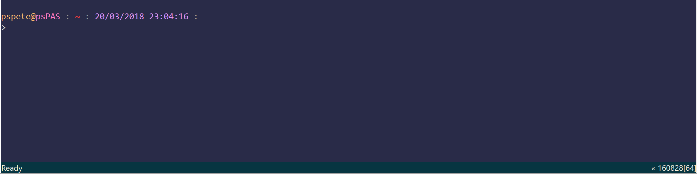
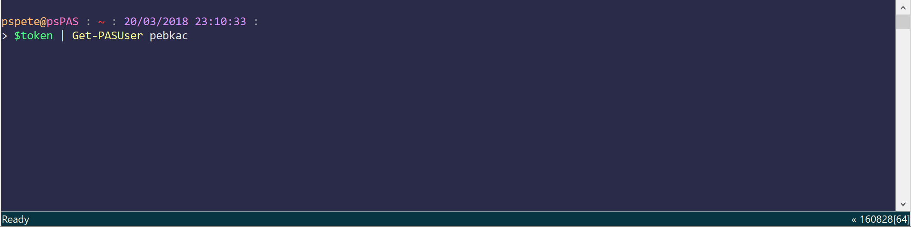
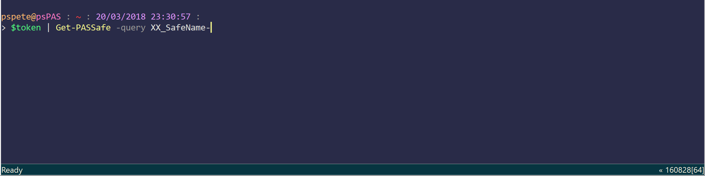

# psPAS

[](https://ci.appveyor.com/project/pspete/pspas/branch/master)
[](https://ci.appveyor.com/project/pspete/pspas)
[](https://coveralls.io/github/pspete/psPAS)
[](https://www.powershellgallery.com/packages/psPAS)
[](https://github.com/pspete/psPAS/blob/master/LICENSE.md)

## **PowerShell Module for CyberArk Privileged Account Security**

Use PowerShell to manage CyberArk via the Web Services REST API.

Contains all published methods of the API up to CyberArk v10.2.

----------

- [psPAS](#pspas)
  - [Introduction](#powershell-module-for-cyberark-privileged-account-security)
  - [Usage](#usage)
  - [Module Functions](#module-functions)
  - [Installation](#installation)
    - [Prerequisites](#prerequisites)
    - [Install Options](#install-options)
    - [Verification](#verification)
  - [Changelog](#changelog)
  - [Author](#author)
  - [License](#license)
  - [Contributing](#contributing)
  - [Acknowledgements](#acknowledgements)

## Usage

It all starts with a logon

```powershell
#Logon to CyberArk
$Credentials = Get-Credential
$token = New-PASSession -Credential $Credentials -BaseURI https://PVWA_URL
```

The output of `New-PASSession` can be used as input for subsequent commands.

<p></p>

In the below examples, the `$token` variable contains the values for the</br>
`sessionToken` & `baseURI` parameters, which are mandatory for all functions.

```powershell
#Find an account
$token | Get-PASAccount -Keywords "root server.name" -Safe UNIX
```

Use the pipeline to allow multiple successive commands to be executed.

```powershell
#Logon, find an account, update some acccount properties, then logoff
$Credentials = Get-Credential
$Credentials | New-PASSession -BaseURI https://PVWA_URL | Get-PASAccount pete |
Set-PASAccount -Address 10.10.10.10 -Name NewName-psPAS-Test -UserName pspete |
Close-PASSession
```

Save time on repetitive support tasks...

```powershell
#Activate a Suspended CyberArk User
$token = $Credentials | New-PASSession -BaseURI https://cyberark
$token | Get-PASUser PebKac | Unblock-PASUser -Suspended $false
```

<p></p>

```powershell
#Add a User to a group
$token | Get-PASUser -UserName User | Add-PASGroupMember Group

#Add multiple users to a group
$users | Foreach-Object {
  $token | Add-PASGroupMember -GroupName YourGroup -UserName $_.UserName
}
```

Streamline your safe creation process...

```powershell
#create a safe
$token | Add-PASSafe -SafeName psPAS `
  -ManagingCPM PasswordManager -NumberOfVersionsRetention 10

#create a safe and add access for a user
$token | Add-PASSafe -SafeName NewSafe `
  -ManagingCPM YourCPM -NumberOfDaysRetention 5 |
  Add-PASSafeMember -MemberName YourUser -SearchIn YourDomain.Com `
  -UseAccounts $true -RetrieveAccounts $false -ListAccounts $true `
  -ViewAuditLog $false -ViewSafeMembers $false
```

<p></p>

Achieve consistent safe permissions...

```powershell
#apply a set of permissions to safe
$token | Add-PASSafeMember -SafeName YourSafe -MemberName SafeAdmins `
  -SearchIn Vault -UseAccounts $false -RetrieveAccounts $false `
  -ListAccounts $true -AddAccounts $true -UpdateAccountContent $true `
  -UpdateAccountProperties $true -InitiateCPMAccountManagementOperations $true `
  -SpecifyNextAccountContent $true -RenameAccounts $true -DeleteAccounts $true `
  -UnlockAccounts $true -ManageSafe $true -ManageSafeMembers $true `
  -BackupSafe $true -ViewAuditLog $true -ViewSafeMembers $true `
  -RequestsAuthorizationLevel $false -AccessWithoutConfirmation $false `
  -CreateFolders $true -DeleteFolders $true -MoveAccountsAndFolders $true

$token | Add-PASSafeMember -SafeName YourSafe -MemberName SafeUsers `
  -SearchIn domain.com -UseAccounts $true -RetrieveAccounts $false `
  -ListAccounts $true -ViewAuditLog $false -ViewSafeMembers $false

$token | Add-PASSafeMember -SafeName YourSafe -MemberName ReadOnlyGroup `
  -SearchIn vault -UseAccounts $false -RetrieveAccounts $false `
  -ListAccounts $true -ViewAuditLog $true -ViewSafeMembers $true

$token | Add-PASSafeMember -SafeName YourSafe -MemberName RequestApprover `
  -SearchIn domain.com -UseAccounts $false -RetrieveAccounts $false `
  -ListAccounts $true -ViewAuditLog $true -ViewSafeMembers $true `
  -RequestsAuthorizationLevel 1
```

Enact changes across multiple safes, with speed...

```powershell
#update a permission on multiple safes
$token | Get-PASSafe -query Safe_Name-Pattern |
  Set-PASSafeMember -MemberName SafeAdmins -SpecifyNextAccountContent $false
```

```powershell
#Update Version Retention on all Safes
$token | Get-PASSafe | Set-PASSafe -NumberOfVersionsRetention 25
```

<p></p>

Onboard a User Account

```powershell
#Add an account to a safe and assign a CPM Platform
$TargetPassword = Read-Host -AsSecureString

$token | Add-PASAccount -safe YourSafe -PlatformID WINDOMAIN -Address YourDomain.com `
  -Password $TargetPassword -username TargetAccount
```

Onboard User Accounts, in bulk...

```powershell
#Import CSV of Account Details
Import-CSV .\users.csv | Foreach-Object{
  #Convert Password Value to SecureString
  $Password = | $_.Password ConvertTo-SecureString -AsPlainText -force
  #Onboard Account
  $token | Add-PASAccount -safe $_.Safe -PlatformID $_.PlatformID -Address $_.Address `
    -Password $password -UserName $_.UserName `
    -DynamicProperties @{"Label" = $_.Label}
}
```

Check-In locked accounts

```powershell
#Find an account and check it in
$token | Get-PASAccount -Keywords "YourUser" -Safe YourSafe | Unlock-PASAccount
```

## <a id="CyberArk_Version_Compatibility"></a> Module Functions

Your version of CyberArk determines which functions of psPAS will be supported.

Check the below table to determine what is available for you to use.

The CyberArk Version listed is the minimum required to use the function.

**Function Name**|**Description**|**CyberArk</br>Version**</br>
-----|-----|-----:
`New-PASSession`|Authenticates a user </br>to CyberArk Vault|9.0
`Close-PASSession`|Logoff from CyberArk </br>Vault.|9.0
`New-PASSAMLSession`|Authenticates a </br>user to CyberArk </br>Vault using SAML|9.7
`Close-PASSAMLSession`|Logoff from CyberArk </br>Vault SAML Session.|9.7
`New-PASSharedSession`|Authenticates a </br>user to CyberArk Vault.|9.7
`Close-PASSharedSession`|Logoff from CyberArk </br>Vault shared user.|9.7
`Add-PASPublicSSHKey`|Adds an authorised </br>public SSH key for a </br>specific user in the </br>Vault.|9.6
`Get-PASPublicSSHKey`|Retrieves a user's </br>SSH Keys.|9.6
`Remove-PASPublicSSHKey`|Deletes a specific </br>Public SSH Key from </br>a specific vault user|9.6
`Add-PASAccountACL`|Adds a new privileged </br>command rule to an </br>account.|9.0
`Get-PASAccountACL`|Lists privileged </br>commands rule for an </br>account|9.0
`Remove-PASAccountACL`|Deletes privileged </br>commands rule from </br>an account|9.0
`Add-PASAccountGroupMember`|Adds an </br>account as a member </br>of an account group.|9.95
`Get-PASAccountGroup`|Returns all the </br>account groups in a </br>specific Safe.|9.10
`Get-PASAccountGroupMember`|Returns all </br>the members of a </br>specific account group.|9.10
`New-PASAccountGroup`|Adds a new account </br>group to the Vault|9.95
`Remove-PASAccountGroupMember`|Deletes a member </br>of an account group|9.10
`Add-PASAccount`|Adds a new privileged </br>account to the Vault|9.0
`Add-PASPendingAccount`|Adds discovered </br>account or SSH key as </br>a pending account in </br>the accounts feed.|9.7
`Get-PASAccount`|Returns information </br>about an account.|9.3
`Get-PASAccountActivity`|Returns activities </br>for an account.|9.7
`Get-PASAccountPassword`|Returns password </br>for an account.|9.7
`Invoke-PASCredChange`|Initiate CPM password </br>change to new random </br>or specified value.|9.10
`Invoke-PASCredReconcile`|Initiates password </br>reconcile by the CPM </br>to a new random password.|9.10
`Invoke-PASCredVerify`|Marks account for </br>immediate verification </br>by the CPM.|9.10
`Remove-PASAccount`|Deletes an account|9.3
`Set-PASAccount`|Updates an existing </br>accounts details.|9.5
`Start-PASCredChange`|Initiates an immediate </br>password change by the </br>CPM to a new random </br>password.|9.3
`Start-PASCredVerify`|Marks account for </br>immediate verification </br>by the CPM|9.7
`Unlock-PASAccount`|Checks in an exclusive </br>account in to the Vault.|9.10
`Add-PASApplication`|Adds a new application </br>to the Vault|9.1
`Add-PASApplicationAuthenticationMethod`|Adds an authentication </br>method to an application.|9.1
`Get-PASApplication`|Returns details of </br>applications in the Vault|9.1
`Get-PASApplicationAuthenticationMethod`|Returns information about </br>all of the authentication </br>methods of a specific </br>application.|9.1
`Remove-PASApplication`|Deletes an application|9.1
`Remove-PASApplicationAuthenticationMethod`|Deletes an authentication </br>method from an application|9.1
`Get-PASPSMConnectionParameter`|Get required parameters to </br>connect through PSM|9.10
`Get-PASPSMRecording`|Get details of PSM </br>Recording|9.10
`Get-PASPSMSession`|Get details of Live PSM </br>Sessions|9.10
`Resume-PASPSMSession`|Resumes a Suspended PSM </br>Session.|10.2
`Stop-PASPSMSession`|Terminates a Live PSM </br>Session.|10.1
`Suspend-PASPSMSession`|Suspends a Live PSM </br>Session.|10.2
`Get-PASOnboardingRule`|Gets all automatic </br>on-boarding rules|9.7
`New-PASOnboardingRule`|Adds a new on-boarding </br>rule to the Vault|9.7
`Remove-PASOnboardingRule`|Deletes an automatic </br>on-boarding rule|9.7
`Get-PASPlatform`|Retrieves details of a </br>specified platform from </br>the Vault.|9.10
`Import-PASPlatform`|Import a new platform|10.2
`Add-PASPolicyACL`|Adds a new privileged </br>command rule|9.0
`Get-PASPolicyACL`|Lists OPM Rules for </br>a policy|9.0
`Remove-PASPolicyACL`|Delete all privileged </br>commands on policy|9.0
`Approve-PASRequest`|Confirm a single request|9.10
`Deny-PASRequest`|Reject a single request|9.10
`Get-PASRequest`|List requests|9.10
`Get-PASRequestDetail`|Get request details|9.10
`New-PASRequest`|Creates an access request </br>for a specific account|9.10
`Remove-PASRequest`|Deletes a request from </br>the Vault|9.10
`Add-PASSafeMember`|Adds a Safe Member to </br>a safe|9.3
`Get-PASSafeMember`|Lists the members of a </br>Safe|9.7
`Remove-PASSafeMember`|Removes a member from </br>a safe|9.3
`Set-PASSafeMember`|Updates a Safe Member's </br>Permissions|9.3
`Add-PASSafe`|Adds a new safe to the </br>Vault|9.2
`Get-PASSafe`|Returns safe details </br>from the vault.|9.7
`Remove-PASSafe`|Deletes a safe from the </br>Vault|9.3
`Set-PASSafe`|Updates a safe in the </br>Vault|9.3
`Get-PASSafeShareLogo`|Returns details of </br>SafeShare Logo|9.7
`Get-PASServer`|Returns details of the </br>Web Service Server|9.7
`Get-PASServerWebService`|Returns details </br>of the Web Service|9.7
`Get-PASComponentDetail`|Returns details & health </br>information about CyberArk </br>component instances.|10.1
`Get-PASComponentSummary`|Returns consolidated </br>information about </br>CyberArk Components.|10.1
`Add-PASGroupMember`|Adds a vault user as </br>a group member|9.7
`Get-PASLoggedOnUser`|Returns details of </br>the logged on user|9.7
`Get-PASUser`|Returns details of a user|9.7
`New-PASUser`|Creates a new vault user|9.7
`Remove-PASUser`|Deletes a vault user|9.7
`Set-PASUser`|Updates a vault user|9.7
`Unblock-PASUser`|Activates a suspended user|9.7

## Installation

### Prerequisites

- Requires Powershell v3 (minimum)
- CyberArk PAS REST API/Web Service
- A user with which to authenticate, with appropriate Vault/Safe permissions.

### Install Options

This repository contains a folder named ```psPAS```.

The folder needs to be copied to one of your PowerShell Module Directories.

Use one of the following methods:

#### Option 1: Install from PowerShell Gallery

PowerShell 5.0 or above & Administrator rights are required.

To download the module from the [PowerShell Gallery](https://www.powershellgallery.com/packages/psPAS/), </br>
from an elevated PowerShell prompt, run:

````Install-Module -Name psPAS -Scope CurrentUser````

#### Option 2: Manual Install

Find your PowerShell Module Paths with the following command:

```powershell

$env:PSModulePath.split(';')

```

[Download the ```master branch```](https://github.com/pspete/psPAS/archive/master.zip)

Extract the archive

Copy the ```psPAS``` folder to your "Powershell Modules" directory of choice.

#### Verification

Validate Module Exists on your local machine:

```powershell

Get-Module -ListAvailable psPAS

```

Import the module:

```powershell

Import-Module psPAS

```

List Module Commands:

```powershell

Get-Command -Module psPAS

```

Get detailed information on specific commands:

```powershell

Get-Help Add-PASUser -Full

```

## Changelog

All notable changes to this project will be documented in the [Changelog](CHANGELOG.md)

## Author

- **Pete Maan** - [pspete](https://github.com/pspete)

## License

This project is [licensed under the MIT License](LICENSE.md).

## Contributing

Any and all contributions to this project are appreciated.

The SAML authentication capability needs testing, no federation service is</br>
available to me to confirm that the functionality works as required...

See the [CONTRIBUTING.md](CONTRIBUTING.md) for a few more details.

## Acknowledgements

Hat Tips:

**Warren Frame**
([RamblingCookieMonster](https://github.com/RamblingCookieMonster)) for the borrowed [Add-ObjectDetail.ps1](https://github.com/RamblingCookieMonster/PowerShell/blob/master/Add-ObjectDetail.ps1)
& </br>[New-DynamicParam.ps1](https://github.com/RamblingCookieMonster/PowerShell/blob/master/New-DynamicParam.ps1)
helper functions.

**Joe Garcia** ([infamousjoeg](https://github.com/infamousjoeg))
for the unofficial API documentation

Chapeau!